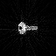

# CT Reconstruction Implementation

This is a implementation of CT reconstruction.

- Input image : `test.png`. It will be resized to square.
- Run `python calculate.py` to get the result. Then following files will be generated.
    - `test_resized.png` : input image resized to square
    - `test_samples.npy`, `test_samples.png` : selection matrix
    - `test_detection` : detection matrix
    - `test_result.npy` : reconstructed image in numpy file format
- Run `python visualize.py` to visualize the result. Then following files will be generated.
    - `test_result.png` : reconstructed image

## Result
Input image

Reconstructed image

